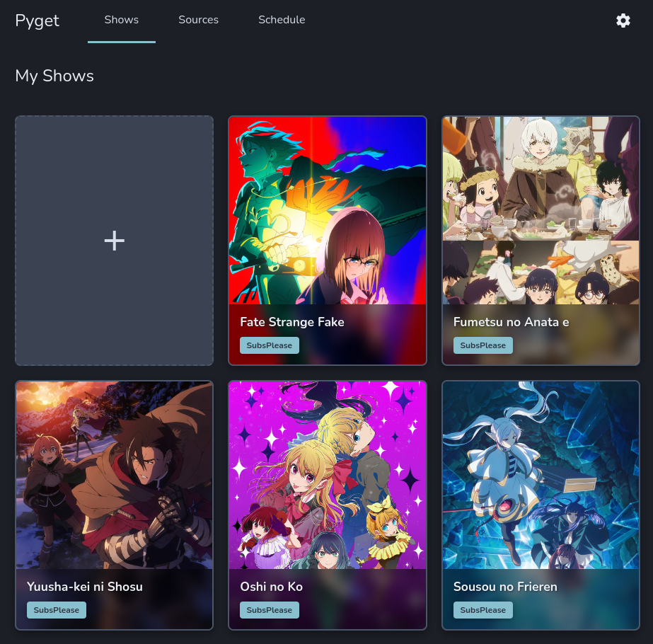

# Pyget Web

A web interface for managing anime RSS feeds and automatically downloading new episodes via Transmission.



## Features

- Adds shows from RSS feeds
- Drag-and-drop artwork into show cards to set artwork
- Release calendar to show when episodes air (based on previous downloads)

## Prerequisites

- Python 3.8+
- Transmission daemon running with RPC enabled.

## Usage

Clone the repo
```bash
git clone https://github.com/thnikk/pyget-web
```

Cd into the repo
```bash
cd pyget-web
```

Run the launcher script to start the app:
```bash
./run.sh
```

To install as a systemd user service:
```bash
./run.sh --install
```

Once it's running, open your browser and navigate to `http://localhost:5123`. If you want to use a different port, you can use the argument `--port` when launching the server.
